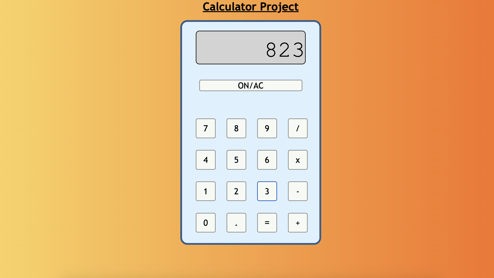

# Calculator Project

A project to build a simple functioning calculator on the back of the content learned so far in modules 1, 2 and 3 of the \_nology self-paced web development course.

---

## Description

The project consists of 3 main aims:

1. To build a working calculator.
2. To practice using Git and GitHub flow.
3. To apply what I've been learning in the course so far. 

The calculator I have created accepts multiple inputs (including numbers with decimal places), can perform an addition, subtraction, multiplication or division operation and returns the output accurately. It also has a button to clear the number on the screen.

I applied my knowledge of HTML to create the markup for my page, adding ids/classes and tags as appropriate. I used CSS to create a more attractive design whilst ensuring that it would be responsive to different screen sizes by testing my knowledge of media queries. I also implemented flex-boxes and grid layouts to ensure the positioning on the page was as I wanted it.

I implemented my recently acquired knowledge of JavaScript, utilising variables, functions, arrays and array iterators, fixing bugs using the console and manipulating the DOM in order to create a simple functioning calculator.

On top of this I conducted my own independent research into certain methods new to me that I wished to use.

---

## Usage Instructions

* Use the 'ON/AC' button to 'switch the calculator on' (this is currently just for aesthetic purposes as it will work instantly anyway). This button also resets the display at any point back to zero for a new calculation. 
* The font-size of the numbers will reduce to fit the screen. 
* The biggest number one can enter is 9999999999999999999999999999 (28 characters), after this an error message will display underneath the screen.
* Click the relevant numbers and operand keys to perform the calculation. 
* The result of the calculation will appear in the same display. 
* The calculator can perform simple addition, subtraction, division and multiplication calculations including with decimal numbers. 
* Calculations can also be performed using the result of the previous calculation. 

---

## Examples

- Addition: 297 + 103 = 400
- Subtraction: 926 - 716 = 210
- Multiplication: 6 x 6 = 36
- Division: 299 / 5 = 59.8
- Decimal places: 0.3 + 0.5 = 0.8
- Using the result of a previous calculation: 12 x 6 = 72 x 2 = 144

---

## Future Improvements

I intend to improve the calculator further by adding the following improvements:
* ability to perform minus calculations
* percentage functionality 
* functionality to be able to perform 2 or more calculations at once for example, 6 x 6 x 6 = 216. 

---

## How it looks

